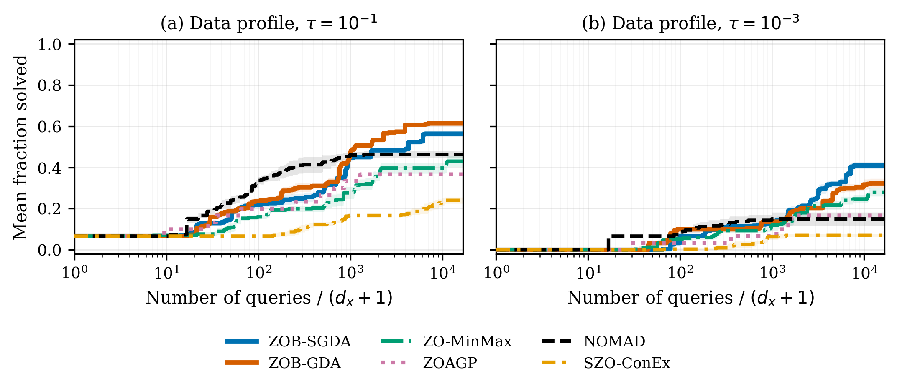

# Query-Efficient Zeroth-Order Constrained Optimization on CUTEst

Code, parameter rules, and results for the 30-problem comparison in *Query-Efficient Zeroth-Order Algorithms for Nonconvex Constrained Optimization*. The release contains **1,530 runs**: 300 each for ZOB-GDA, ZOB-SGDA, NOMAD, ZO-MinMax, and SZO-ConEx, and 30 for ZOAGP. Stochastic methods use seeds 1--10. All methods use the fixed settings below, without problem-specific tuning.

## Results

The table reports means and 95% Student-t confidence half-widths across seeds. AUC is the normalized area on the logarithmic query axis.

| Algorithm | Mean feasible | Avg. feasible rate | Solved: 0.1 | Solved: 0.001 | AUC: 0.1 | AUC: 0.001 |
| --- | ---: | ---: | ---: | ---: | ---: | ---: |
| ZOB-SGDA | 22.50 +/- 0.38 | 0.750 | 16.90 +/- 0.41 | 12.30 +/- 0.48 | 0.2602 +/- 0.0079 | 0.1096 +/- 0.0060 |
| ZOB-GDA | 22.30 +/- 0.35 | 0.743 | 18.40 +/- 0.37 | 9.70 +/- 0.68 | 0.2875 +/- 0.0036 | 0.0994 +/- 0.0046 |
| NOMAD | 25.50 +/- 0.77 | 0.850 | 13.90 +/- 0.53 | 4.50 +/- 0.97 | 0.2890 +/- 0.0098 | 0.0851 +/- 0.0141 |
| ZOAGP | 18 | 0.600 | 11 | 5 | 0.2108 | 0.0605 |
| ZO-MinMax | 18.20 +/- 0.56 | 0.607 | 12.90 +/- 0.79 | 8.40 +/- 0.60 | 0.1987 +/- 0.0119 | 0.0831 +/- 0.0069 |
| SZO-ConEx | 16.30 +/- 0.35 | 0.543 | 7.20 +/- 0.45 | 2.10 +/- 0.23 | 0.1115 +/- 0.0024 | 0.0246 +/- 0.0049 |



[LaTeX table](results/summary_table.tex) | [PDF figure](results/figures/data_profiles_combined.pdf) | [Every problem and seed](results/per_run.md) | [Full-precision run metrics](results/run_metrics.csv)

## Reconstruct the Table and Figure

This workflow uses final per-run metrics and first-target query counts. Use Python 3.10, preferably 3.10.21, from the repository root:

```bash
python3 -m venv .venv
source .venv/bin/activate
python -m pip install -e .
python scripts/verify_release.py
python -m unittest discover -s tests -v
python -m cutest_benchmark.analysis --out reproduced
python scripts/verify_reproduction.py --out reproduced
```

The analysis writes CSV tables, `summary_table.tex`, `per_run.md`, and PDF/PNG figures under `reproduced/`. The verification command checks every tabular value, the LaTeX and per-run text, and the PNG pixels against the retained release. Pixel equality also depends on the rendering environment. Output directories are separate from retained data.

## Contents

| Path | Contents |
| --- | --- |
| `src/cutest_benchmark/` | All six solvers, oracle, parameter resolver, recording, analysis, plotting, and saved-point validation |
| `config/problems.csv` | Dimensions, original constraints, converted inequalities, and query budgets |
| `config/parameters.json` | Full-precision parameters resolved from the uniform formulas for all 180 problem/algorithm combinations |
| `config/protocol.json` | Seeds, execution/scoring limits, sampling, and flush settings |
| `config/historical_problem_parameters.csv` | Previous problem-specific parameters, one row per problem and tunable algorithm; reference only |
| `config/representative_configurations.csv` | Four representative tested configurations per tunable method, plus the single NOMAD default configuration; parameters, evidence scope, budgets, and retained-setting flags |
| `config/references.csv` | Shared verified reference objectives, initial objectives, gap scales, and historical sensitivity references |
| `config/reference_points.json.gz` | The 29 verified reference witnesses and their provenance |
| `config/nomad_rng_states.json` | Expected first-callback NOMAD RNG state for each seed |
| `config/source_versions.json` | Frozen numerical-source hashes, active configuration hashes, and dependency versions |
| `environment/` | Compiler lock, upstream source archives, 30 SIF definitions, and licenses |
| `results/hitting_times.csv` | First recorded query reaching each fixed target, one final summary per problem/algorithm/seed/target |
| `results/run_metrics.csv`, `results/per_run.md` | Final metrics for every algorithm, problem, and retained seed |
| `results/run_info.csv` | Available execution counts, stopping states, and correction flags |
| `results/incumbents.json.gz` | Best-feasible and minimum-violation vectors, when available, for all 1,530 runs |
| `results/solver_outputs.json.gz` | Final states and termination details of the 630 reference-baseline runs |
| `results/saved_point_checks.csv` | Native and, where required, independent high-precision checks of 2,623 saved vectors |
| `results/` | Seed counts, per-problem rates, hitting times, profile/AUC data, summary, table, and figures |
| `tests/`, `scripts/` | Numerical/protocol tests, environment setup, and release/reproduction verification |
| `checksums.json` | SHA-256 hashes of distributed files, excluding this manifest itself |

The final metrics and first-target query counts suffice to reconstruct the published table, profiles, AUCs, and confidence intervals at the frozen reference values and thresholds.

Parameter-search trajectories, duplicate figures, installed environments, and compiled caches are not included. All release paths are relative. Compressed JSON files use `null` for an absent vector and strings `"inf"`, `"-inf"`, or `"nan"` for nonfinite scalars.

## Parameter Configurations

Let $d=d_x$ and let $Q$ be the problem's query budget. The runner checks `config/parameters.json` against `parameters.select_parameters(solver, d, Q)` before launching a run. No tuning is performed during execution.

| Algorithm | Primal step | Dual step | Block/directions | Difference radius |
| --- | --- | --- | --- | --- |
| ZOB-GDA | $\alpha=0.08$ | $\beta=0.05$ | $b=\lceil\sqrt d\rceil$ | $r_k=0.003/\sqrt{k+1}$ |
| ZOB-SGDA | $\alpha=0.1$ | $\beta=0.05$ | $b=\min\{d,\max\{1,\lceil0.75\sqrt d\rceil\}\}$ | $r_k=0.003/\sqrt{k+1}$ |
| ZOAGP | $\alpha_t=0.3(101)/(100+\sqrt t)$ | $\beta=0.09$ | All coordinates | $r_t=0.003/\sqrt t$ |
| ZO-MinMax | $\alpha=0.1$ | $\beta=0.003$ | One sphere direction | $r=0.001$ |
| SZO-ConEx | $\alpha=0.03$ | $\beta=0.009$ | Independent Gaussian directions | $r=0.01$ |

The parameter `beta_over_alpha` multiplies the *initial* primal step, so the dual steps remain constant. All dual variables start at zero. The dual upper bound is 100 except for SZO-ConEx, which projects onto the nonnegative orthant without a finite upper bound.

ZOB-SGDA uses $N=d/b$, $K=\max\{1,\lfloor Q/(b+1)\rfloor\}$, and memory ratio $\lambda=1$:

$$
\gamma=\min\left\{\frac1{40},\frac1{\sqrt{KN}},\sqrt{\frac{\alpha}{768N\beta}}\right\},
\qquad p=\frac{N\gamma}{\alpha}.
$$

The selected-coordinate gradient includes $p(x-z)$; after the primal and dual updates, $z^+=(1-\gamma)z+\gamma x^+$, with $z^0=x^0$. Other theorem conditions involving unknown Lipschitz constants, including $p\ge3L$, are not certified by this empirical rule.

Both ZOB methods sample coordinates without replacement and share one base evaluation. They do not apply a $d/b$ gradient multiplier. Coordinate $i$ uses step $r_k\max\{1,|x_i|\}$, forward if permitted by the box, otherwise backward, otherwise no perturbed query. The primal point is projected onto the box.

ZOAGP uses decreasing dual regularization $\lambda_t=0.1/t^{1/4}$, with $t=1,2,\ldots$. Standard-basis forward differences are followed by a primal update and then a dual update at the new primal point. ZO-MinMax uses unit-sphere differences with the dimension multiplier and primal-first alternating projections. Both use the exact affine dual gradient from joint constraint values, and cache the new primal evaluation: their iterations cost $d+1$ and two new queries, respectively.

SZO-ConEx uses the **single-loop** method, with constant extrapolation $\theta=1$, $\eta=1/\alpha$, $\tau=1/\beta$, and unit averaging weights. The constraint model and primal gradient use independent Gaussian samples, with separate directions for the individual scalar functions. A full iteration costs $2m+2$ joint queries, where $m$ is the converted inequality count. For HAIFAL, $m=17{,}916$, and two iterations plus initialization and averaging cost 71,670 queries. Statistics always use the best feasible *queried* point, not necessarily the last iterate or mean.

NOMAD uses its default parameters. Each seed runs in a fresh process, and the first-callback RNG state is checked.

[Representative tested configurations](config/representative_configurations.csv) lists the retained setting and three evaluated settings for each tunable method. NOMAD has one default hyperparameter configuration. Blank parameter fields mean not applicable, and `unbounded` means no finite dual upper bound.

## Install the Solver Environment

The retained runs used native Apple Silicon macOS, Python 3.10.21, NumPy 2.2.6, SciPy 1.15.2, pandas 2.3.3, PyCUTEst 1.8.2, CUTEst 2.6.0, SIFDecode 3.1.0, and **PyNomadBBO 4.5.1**. Plotting uses Matplotlib 3.10.9; precision checks use mpmath 1.3.0. The supplied compiler lock targets macOS arm64. Numerical libraries use one thread per process.

Install [micromamba](https://mamba.readthedocs.io/en/latest/installation/micromamba-installation.html) and Apple's command-line development tools. From Bash, choose a runtime prefix without spaces, outside synchronized storage:

```bash
export CUTEST_RUNTIME_PREFIX="$HOME/.local/share/cutest-query-benchmark"
bash scripts/setup_environment.sh
source scripts/activate.sh
```

Setup builds the bundled CUTEst/SIFDecode sources, installs pinned Python dependencies, applies the PyCUTEst conda-toolchain path patch, and checks all 30 problem dimensions and initial values. It needs internet access for conda/Python packages but runs no benchmark. Setup is separate from reconstructing the published statistics.

## Run the Benchmark

Inspect the full selection without constructing an oracle or executing any algorithm:

```bash
python -m cutest_benchmark.runner --out runs
```

Run all 1,530 combinations, then analyze their traces separately:

```bash
python -m cutest_benchmark.runner --out runs --workers 12 --resource-workers 6 --execute
python -m cutest_benchmark.analysis --data runs --out reproduced_new
```

New runs write query histories under the chosen run directory; the analysis extracts their final metrics and target hitting times. The two worker limits apply to dimensions at most 30 and greater than 30. Reduce them for machines with fewer resources. A selected run can use:

```bash
python -m cutest_benchmark.runner --out runs_selected \
  --problems HIMMELP3 --solvers zob_gda zob_sgda --seeds 1 2 --execute
```

Repeating a command resumes completed runs only after verifying output hashes and the input/source/environment manifest. Full-suite analysis requires all 1,530 combinations. Independent checks of the **retained** reference/incumbent vectors require the native environment but run no optimizer:

```bash
python -m cutest_benchmark.validation --out validation
```

## Oracle and Stopping Rules

All algorithms start from the same CUTEst initial point projected onto the variable bounds. Seeds control algorithmic randomness. PyCUTEst drops fixed variables. Two-sided constraints become upper-side then lower-side inequalities. Equalities become two inequalities. No objective or constraint derivatives are requested from CUTEst.

At the original initial point, set $s_f=\max\{1,|f_{\rm raw}(x^0)|\}$ and $s_i=\max\{1,|g_{i,\rm raw}(x^0)|\}$. These fixed scales normalize the objective and converted constraints. One joint query returns the objective and the entire inequality vector. The scaling initialization is outside the query budget.

`config/problems.csv` gives the budgets. The first 27 problems use $\min\{10^6,\max\{50000,1000(d_x+1)\}\}$; HAIFAL, CAMSHAPE, and ROSEPETAL use 100,000 queries. Every solver has a 1,800-second solver limit and a 1,920-second outer watchdog. Only recorded observations within both the query budget and 1,800 seconds are scored. Startup, decoding, and watchdog grace do not extend the scored window. ZOB checks time between iterations, the three reference baselines before each oracle call, and NOMAD uses `MAX_TIME 1800`.

Wall-clock stopping depends on hardware, load, compiler, and concurrency. The published statistics can be reconstructed exactly from the retained summaries. Fresh time-limited optimization trajectories are not promised to be bitwise identical.

## Shared References and Numerical Checks

All algorithms and seeds use the **same verified best-known feasible reference** per problem instead of a certified optimum. The pool includes eligible final runs and retained historical reference witnesses, including development seeds. Its provenance is in `references.csv` and `reference_points.json.gz`. References are frozen during reconstruction and during new runs, not recomputed separately for each algorithm.

For HALDMADS and HAIFAL, better historical scalar records could not be associated with recovered, validated vectors. The primary table uses verified references 0.03463978257053 and -0.02570573129967026. The unrecovered historical values 0.0004315420416905 and -1.1364871944001922 are retained only for a common-reference sensitivity analysis. This requires a complete query-history directory, such as `runs/` produced by the full benchmark command above:

```bash
python -m cutest_benchmark.analysis \
  --data runs --reference-policy historical-sensitivity --out reference_sensitivity
```

## Metrics

A run is feasible when a recorded in-budget incumbent has normalized maximum violation at most $10^{-4}$. With best feasible normalized objective $f^{\rm best}$, initial objective $f^0$, and shared reference $f^{\rm ref}$, define

$$
G=\frac{\max\{0,f^{\rm best}-f^{\rm ref}\}}{\max\{1,|f^0-f^{\rm ref}|\}}.
$$

The unit floor avoids division by a small initial gap. Infeasible runs never count as solved. A missing reference also prevents a solved classification.

For each seed separately, count feasible problems and problems with $G\le\tau$. Mean feasible and mean solved are averages of these suite-level counts. Their 95% intervals are $\bar c\pm t_{0.975,9}s_c/\sqrt{10}$. Avg. feasible rate is mean feasible divided by 30. Deterministic ZOAGP has one suite-level observation and no seed-based interval. The paper table displays $\tau=10^{-1}$ and $10^{-3}$.

Let $q_{p,a,s}(\tau)$ be the first recorded qualifying query, or infinity if no target is reached. Define

$$
d_{a,s}(u;\tau)=\frac1{30}\sum_{p=1}^{30}
\mathbf{1}\{q_{p,a,s}(\tau)/(d_{x,p}+1)\le u\}.
$$

The data-profile line is the mean over seeds. Its band is the pointwise 95% Student-t interval, clipped to $[0,1]$ for display only. ZOAGP has no band. All 30 problems remain in the denominator. With $B=\max_p Q_p/(d_{x,p}+1)=16666.667$, compute each seed's normalized log-AUC as

$$
A_{a,s}(\tau)=\frac1{\log B}\int_1^B d_{a,s}(u;\tau)\,d\log u.
$$

The integral is evaluated exactly for the step profile. Equivalently, average $\log(B/\operatorname{clip}(q/(d_x+1),1,B))/\log B$ across the 30 problems, assigning zero to failures. The AUC interval is computed from the ten **seed-level areas**. These intervals describe seed variability.

### Per-Run Fields

`run_metrics.csv` has a unique `(problem, solver, seed)` key for all 1,530 runs. `per_run.md` displays every row, grouped by problem, without pooling seeds.

- `best_feasible_f`, `best_violation`, `feasible`, `norm_gap`: final scored incumbent metrics. The minimum-violation point may differ from the best feasible point.
- `solved_1e_1`, `solved_1e_2`, `solved_1e_3`: endpoint target indicators. `queries_solved_*` gives first recorded hitting queries; infinity means no hit.
- `queries`, `solver_seconds`: the last eligible recorded checkpoint, not necessarily all executed work. `final_recorded_f` and `final_recorded_violation` describe that checkpoint's evaluated point, not its incumbent.
- `total_queries`: actual executed queries when recovered, including unscored work; blank means unavailable. `iterations` and `returned_average_evaluated` are available for the reference baselines.
- `query_budget`, `scoring_time_seconds`, `excluded_rows`: resource limits and observations excluded from scoring. `status` preserves the final trace status, including numerical and watchdog stops; completion is not a certificate of optimality.
- `feasibility_correction`: identifies the two post-hoc CRESC4 corrections. Nonfinite/missing values are not silently replaced by successful outcomes.
- `nomad_seed_state_verified`, `nomad_initial_rng_state`: the first-callback state from each retained NOMAD seed certificate; blank for other algorithms.

## Implementation Scope

The ZOB core update order is retained from the manuscript implementation. Baselines use [ZOAGP, Algorithm 2.1](https://arxiv.org/pdf/2108.00473), [ZO-MinMax, Algorithm 1](https://proceedings.mlr.press/v119/liu20j/liu20j.pdf), and [SZO-ConEx, Algorithm 1](https://arxiv.org/pdf/2210.04273). Single-loop SZO-ConEx is applied directly on nonconvex problems. The unregularized CUTEst Lagrangian need not satisfy the strong dual concavity in the ZO-MinMax convergence theorem.

## Third-Party Sources

The bundled SIF definitions retain their headers and [upstream license](https://github.com/ralna/SIF/blob/master/LICENSE), reproduced in `environment/SIF-LICENSE`. CUTEst and SIFDecode archives contain their upstream licenses. PyCUTEst and NOMAD are installed separately under their own licenses. Third-party licenses do not grant a license to the authors' benchmark code.
